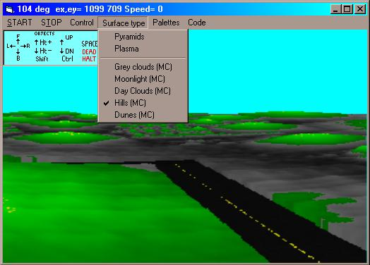

<div align="center">

## VTrack


</div>

### Description

VTrack2 by Robert Rayment This program uses floor ray-casting from the eye onto a color-height byte array (ie for simplicity avoiding separate height & color maps). The color-heights are then projected back to a front surface byte array which blitted to the screen using the API StretchDIBits. The program can be run with or without machine code and it runs for any screen size or color setting There is an automatic mode which goes round a track once with timing. In the VB environment this takes about 300 secs, VB EXE takes between 35 and 65 secs depending on Voxel heights and machine code bewteen 12 and 24 secs on my 400 MHz computer. Controls are the cursor keys to move forward, backward, turn to the left and turn to the right. With Shift the up & down arrows change the height of objects and Ctrl with the up & down arrows moves the viewer up & down. The SPACE bar brings the motion to an immediate halt. With the Pyramids a wall forms a boundary around the surface but with Plasmas the surface rolls over giving continuous motion. There is also collision detection based on the eye coords and the Voxel height in the vicinity on the floor surface. Different palettes can be selected and they take effect immediately. Changing the motion control or surface type requires the START button to be pressed. The casting routine is modified from that of D Brebner's of Unlimited Realities. In particular a spherical correction is applied and the scanning is from -ve to +ve angles placing the viewer in the middle of the screen. The FloorCASTER routine is commented in detail - the effects are very subtle. The machine code routines are in a bin file for use with CallWindowsProc but could easily be converted to a DLL. See also the recent prog from NLS, on PSC, which shows an alternative method for Voxels with 24-bit color. The ZIP file is 40 KB. (ADDITIONS Switch smoothing, plateau surface, collision flash, no collision in clouds).
 
### More Info
 
Just run Vb & Assembler


<span>             |<span>
---                |---
**Submitted On**   |2001-06-20 09:57:08
**By**             |[Robert Rayment](https://github.com/Planet-Source-Code/PSCIndex/blob/master/ByAuthor/robert-rayment.md)
**Level**          |Advanced
**User Rating**    |5.0 (60 globes from 12 users)
**Compatibility**  |VB 6\.0
**Category**       |[Graphics](https://github.com/Planet-Source-Code/PSCIndex/blob/master/ByCategory/graphics__1-46.md)
**World**          |[Visual Basic](https://github.com/Planet-Source-Code/PSCIndex/blob/master/ByWorld/visual-basic.md)
**Archive File**   |[VTrack213966202001\.zip](https://github.com/Planet-Source-Code/robert-rayment-vtrack__1-22766/archive/master.zip)

### API Declarations

```
StretchDIBits
CallWindowsProc (see Ulli)
CopyMemory
```


